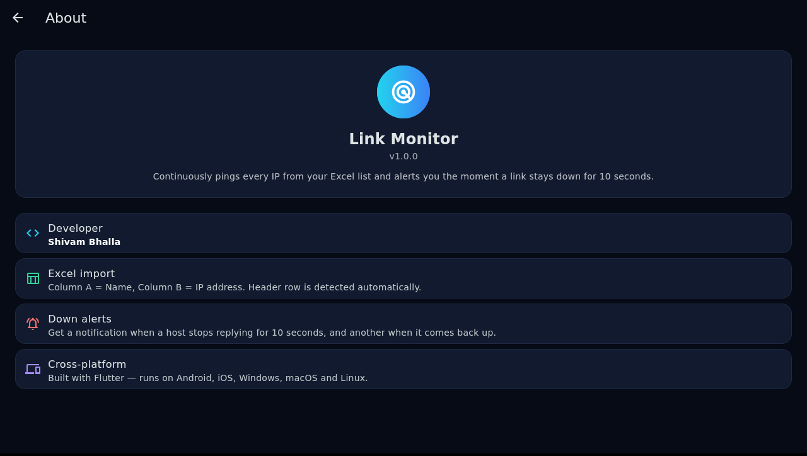

# Link Monitor

A Flutter Android app that continuously pings a list of IPs and alerts you the
moment a link goes down — built for NOC engineers and anyone who babysits
network links.


.

## Download

Grab the ready-to-install APK from the
[**Releases**](https://github.com/shivytyahoo/IP-Link-Monitor/releases) page
(`app-release.apk`), copy it to your phone and install. No build needed.

## Features

- **Excel import** — pick an `.xlsx`/`.xls` file; Column A = Name, Column B = IP.
  A header row is detected automatically.
- **Live ping loop** — every host is pinged every 5 seconds (ICMP via the OS
  `ping` binary, with a TCP fallback on ports 80/443).
- **Down alerts** — a notification fires when a host stops replying for
  10 seconds, and another one when the link recovers.
- **Dark dashboard** — UP / DOWN / TOTAL counters, per-host latency,
  green/red status cards.
- **Pull-to-refresh**, swipe-to-delete, clear-all, and one-tap demo data.
- Hosts are saved on-device (SharedPreferences), so the list survives restarts.

## Excel format

| A (Name)     | B (IP)        |
|--------------|---------------|
| Core Router  | 192.168.1.1   |
| Branch Link  | 10.10.10.2    |

## Permissions

- `INTERNET` — required to ping hosts.
- `POST_NOTIFICATIONS` — required for down/up alerts (asked at runtime on
  Android 13+).

## Build from source

```bash
flutter pub get
flutter build apk --release
# APK: build/app/outputs/flutter-apk/app-release.apk
```

The repo also builds for Linux (`flutter build linux`) — desktop platforms skip
notifications gracefully.

> **Note:** binary files (Gradle wrapper jar, launcher icons) are stored as
> base64 in `tools/binaries/`. After cloning, run once:
>
> ```bash
> bash tools/restore_binaries.sh
> ```

## How it works

`lib/main.dart` holds the whole app (~800 lines):

- `MonitorService` — host list, 5-second ping timer, SharedPreferences
  persistence, notification logic.
- `pingHost()` — tries OS ICMP ping first, falls back to TCP connect on
  ports 80 and 443 (useful on networks that block ICMP).
- `HomeScreen` — dark dashboard with live counters and host cards.
- `AboutPage` — version info and feature summary.

## Limitations

- Ping interval (5 s) and the down threshold (10 s) are currently hardcoded.
- ICMP needs the OS `ping` binary; where it is missing or blocked, the TCP
  fallback decides reachability, so a host with all ports filtered may read
  as down.
- Background execution follows normal Android Doze rules; for 24×7
  monitoring, exempt the app from battery optimization.

## Developer

**Shivam Bhalla** — NOC engineer by day, Flutter dev by night.
